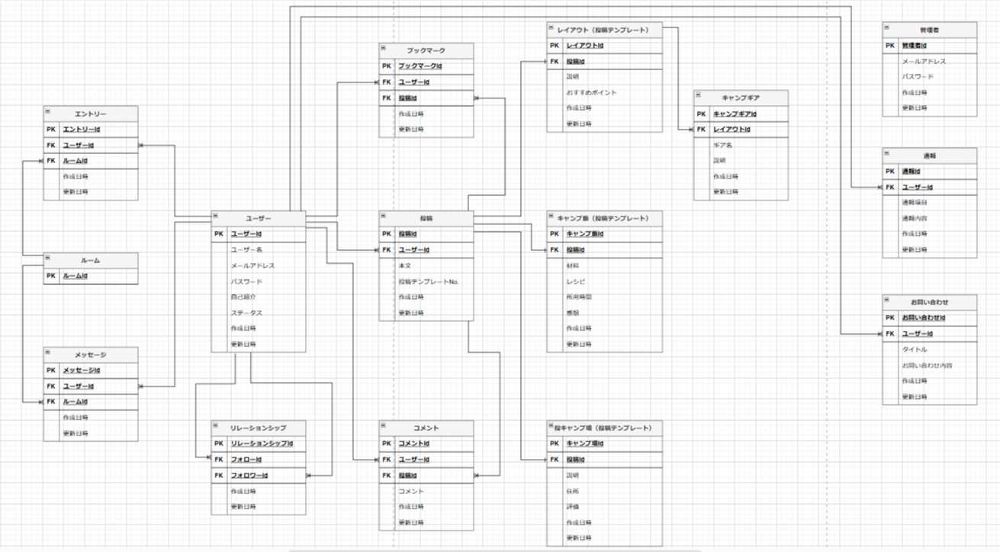

# Camp-out!

## サイト概要

### サイトテーマ
キャンパー達のおすすめキャンプレイアウトやキャンプ飯、 キャンプ場等を集約して閲覧できるSNSサイト。
​
### テーマを選んだ理由
わたしはキャンプが大の趣味です。なかでも、キャンプ道具を集める過程が特に楽しいと感じています。
キャンプ道具を選ぶ際にはよくネットを利用し、他キャンパーの使い心地のレビューや、キャンプレイアウト等を参考にしています。 
しかしながらこのキャンプ情報について、キャンパーの生の声が集約されたサイトはあまりなく、情報収集に時間がかかることも少なくありません。 
したがって、もっとキャンパー達の生の声が集約された情報サイトがあると、自分のみならず、他キャンパーやこれからキャンプを始めたいと思っている人にとっても便利だと考え、このテーマを設定しました。
​
### ターゲットユーザ
- キャンプレイアウト、キャンプ飯、キャンプ場の情報について集約されたものを閲覧したいと思っている人。
- キャンプ情報を通じて他のキャンパーと交流を図りたいと思っている人。
​
### 主な利用シーン
- キャンプレイアウト、キャンプ飯、キャンプ場の情報を探していて、それら情報が集約されたものを閲覧したいとき。
- 他キャンパーとSNSを通じて交流を図りたいとき。
​
## 設計書
- 
​
## 開発環境
- OS：Amazon Linux 2
- 言語：HTML, CSS, JavaScript, Ruby, SQL
- フレームワーク：Ruby on Rails
- JSライブラリ：jQuery, Swiper（複数画像のスライド機能）, Turn.js（ページめくり機能）
- IDE：Cloud9
​
## 使用素材
- サイト全体の背景画像：UnsplashのJeremy Bishopが撮影
- 使用gem：devise（ユーザー認証機能）, kaminari（ページネーション機能）
- 使用プラグイン：Cocoon（ネストしたフォームの動的追加・削除機能）, Raty.js（星評価機能）